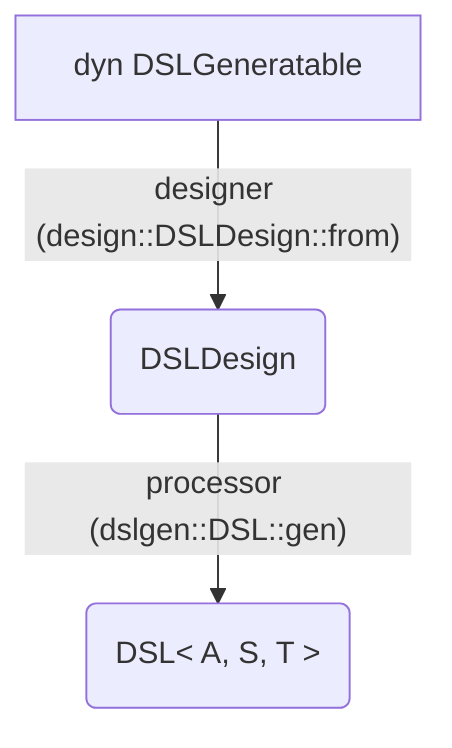

# Compiler

## Features

- dev
- with-serde

## Crates

### bin

none

### lib

- designer
- processor
- bricks
- runtime

## Design

```mermaid
flowchart TD
    A["dyn DSLGeneratable"] -->|"designer (design::DSLDesign::from)"| B("DSLDesign")
    B -->|"processor (dslgen::DSL::gen)"| C("DSL< A, S, T >")
```
