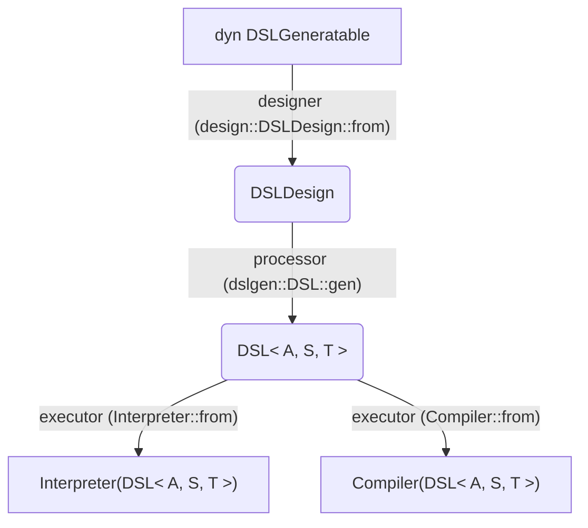

# Compiler

## Features

- with-serde

## Crates

### bin

none

### lib

- **compiler**
- designer
- processor
- executor/compiler
- executor/interpreter

## Design

```mermaid
flowchart TD
    A["dyn DSLGeneratable"] -->|"designer (design::DSLDesign::from)"| B("DSLDesign")
    B -->|"processor (dslgen::DSL::gen)"| C("DSL< A, S, T >")
    C -->|"executor (Interpreter::from)"| D["Interpreter(DSL< A, S, T >)"]
    C -->|"executor (Compiler::from)"| E["Compiler(DSL< A, S, T >)"]
```
